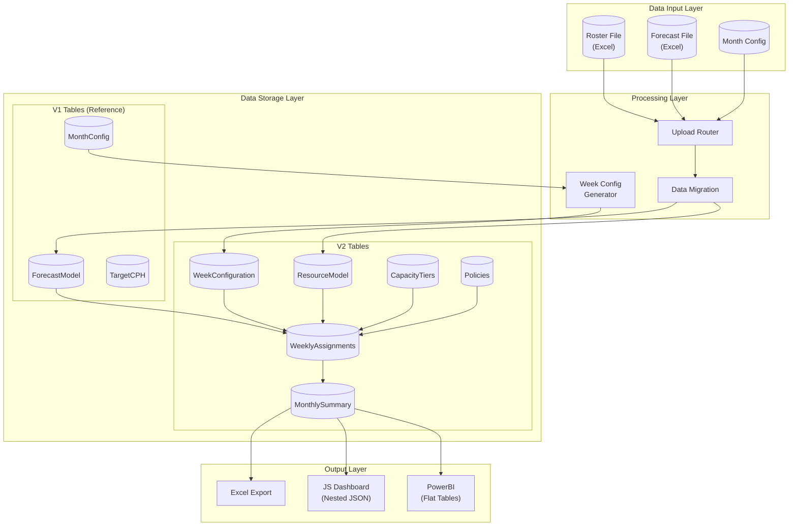
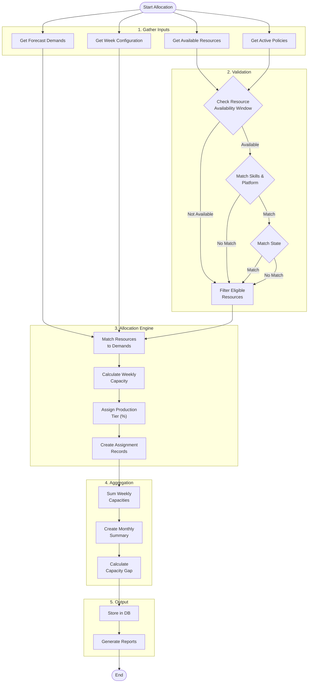
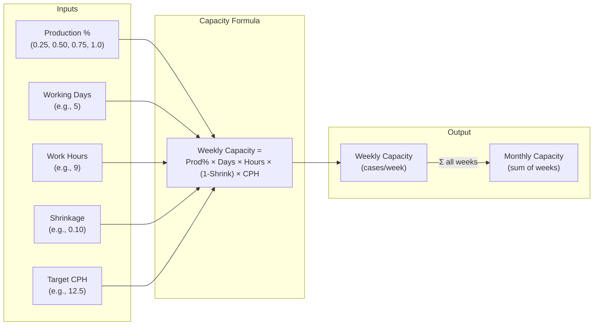
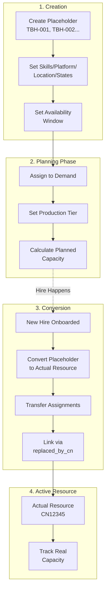
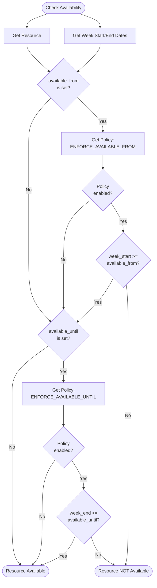
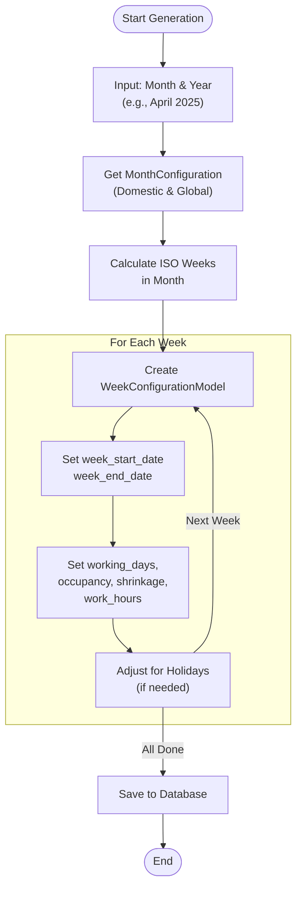
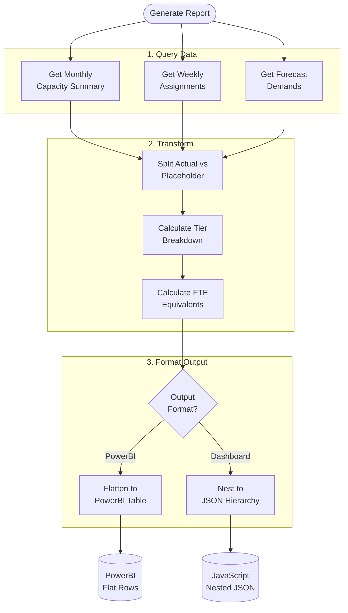
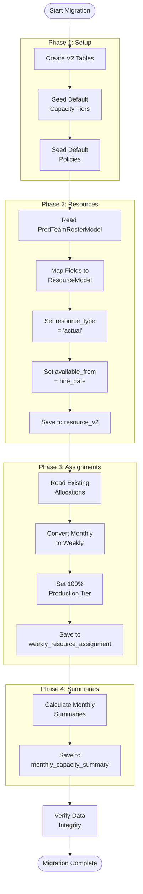

# V2 Architecture - Flow Diagrams

This document contains flow diagrams for the V2 Weekly Capacity & Multi-Group Resource Tracking system.

---

## 1. High-Level Data Flow

---

## 2. Allocation Process Flow

---

## 3. Capacity Calculation Flow

---

## 4. Placeholder Lifecycle Flow

---

## 5. Availability Window Check Flow

---

## 6. Week Configuration Generation Flow

---

## 7. Report Generation Flow

---

## 8. Data Migration Flow (V1 to V2)

---

*Document Version: 1.0*
*Created: 2026-02-18*
