# V2 Architecture - System Design

This document contains system design and component architecture diagrams for the V2 Weekly Capacity & Multi-Group Resource Tracking system.

---

## 1. System Architecture Overview

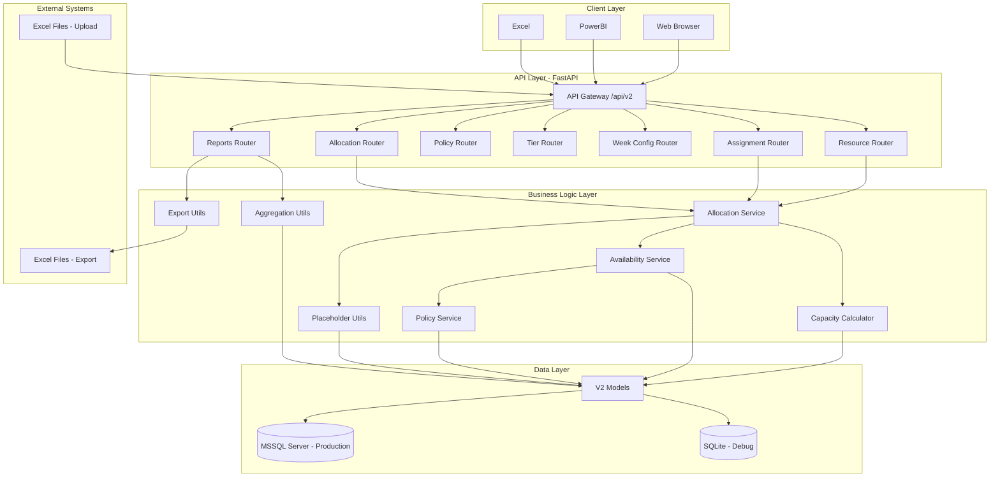

---

## 2. Component Architecture

```mermaid
graph TB
    subgraph API_Layer["API Layer - V2 Routers"]
        R1["resource_router_v2.py"]
        R2["assignment_router_v2.py"]
        R3["policy_router_v2.py"]
        R4["capacity_tier_router.py"]
        R5["week_config_router.py"]
        R6["reports_router_v2.py"]
        R7["allocation_router_v2.py"]
    end

    subgraph Models_Layer["Models - models_v2.py"]
        M1["ResourceModel"]
        M2["WeeklyResourceAssignment"]
        M3["MonthlyCapacitySummary"]
        M4["ProductionCapacityTier"]
        M5["WeekConfiguration"]
        M6["AvailabilityPolicy"]
    end

    subgraph Services_Layer["Services"]
        S1["allocation_v2.py"]
        S2["capacity_calculations_v2.py"]
        S3["availability_utils.py"]
        S4["policy_utils.py"]
        S5["placeholder_utils.py"]
        S6["aggregation_utils.py"]
    end

    subgraph Tests_Layer["Test Layer"]
        T1["test_capacity_calculations_v2.py"]
        T2["test_availability_utils.py"]
        T3["test_policy_utils.py"]
        T4["test_placeholder_utils.py"]
        T5["test_allocation_v2.py"]
        T6["test_reports_v2.py"]
    end

    R1 --> M1
    R2 --> M2
    R3 --> M6
    R4 --> M4
    R5 --> M5
    R6 --> M3
    R7 --> S1

    S1 --> S2
    S1 --> S3
    S1 --> S5
    S3 --> S4
    R6 --> S6

    T1 --> S2
    T2 --> S3
    T3 --> S4
    T4 --> S5
    T5 --> S1
    T6 --> S6
```

---

## 3. Database Schema Overview

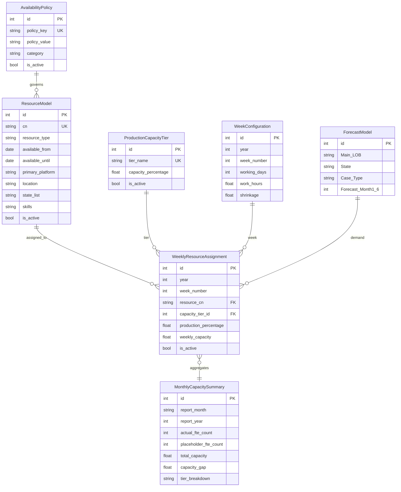

---

## 4. API Endpoint Structure

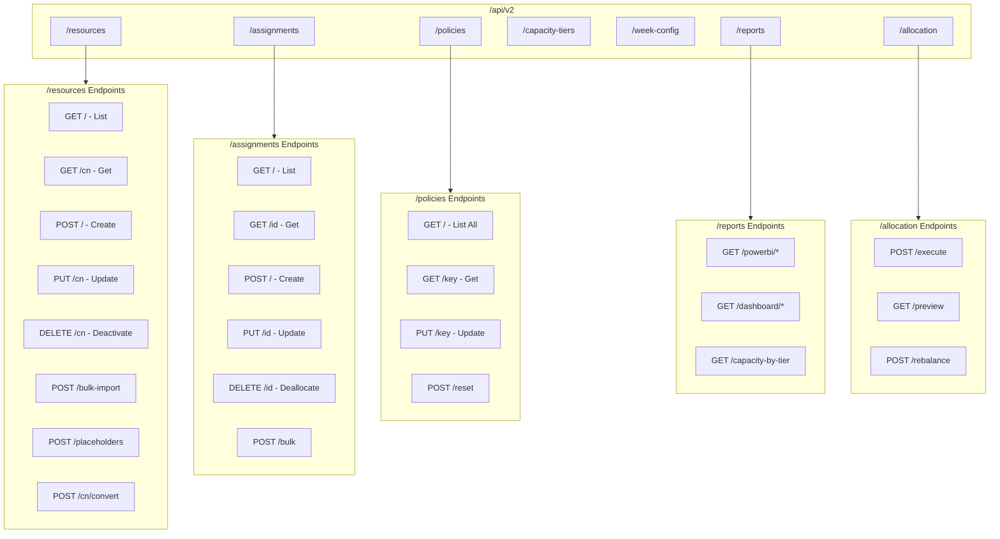

---

## 5. Layered Architecture

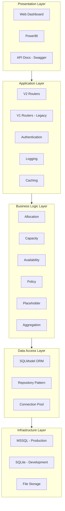

---

## 6. Policy System Architecture

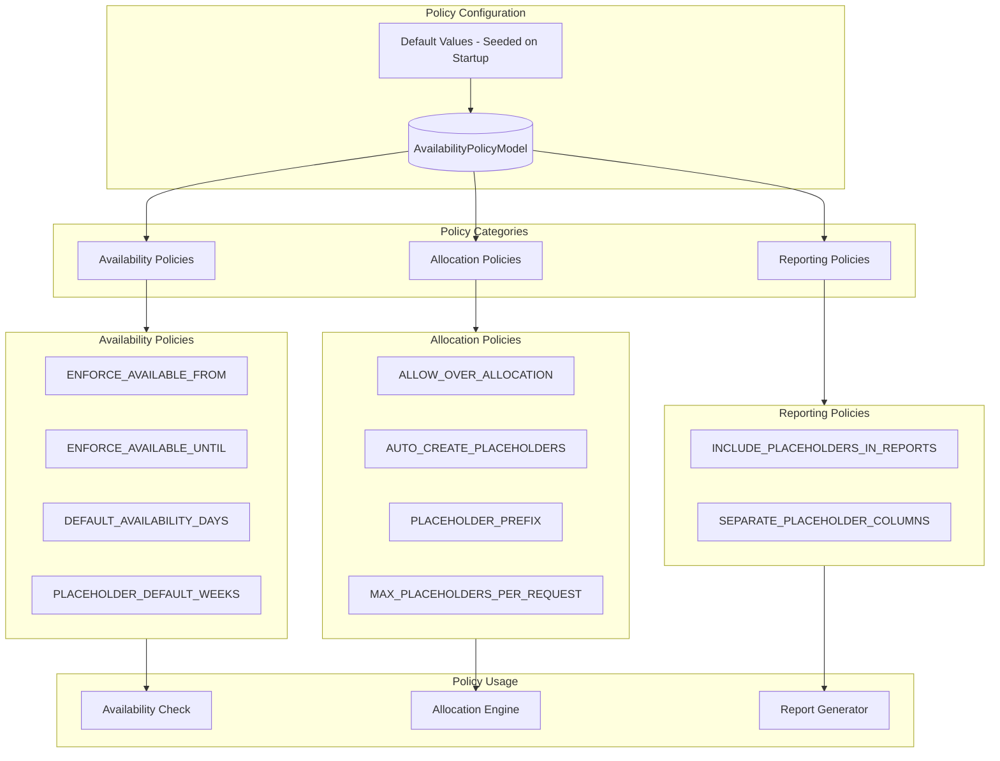

---

## 7. Capacity Tier System

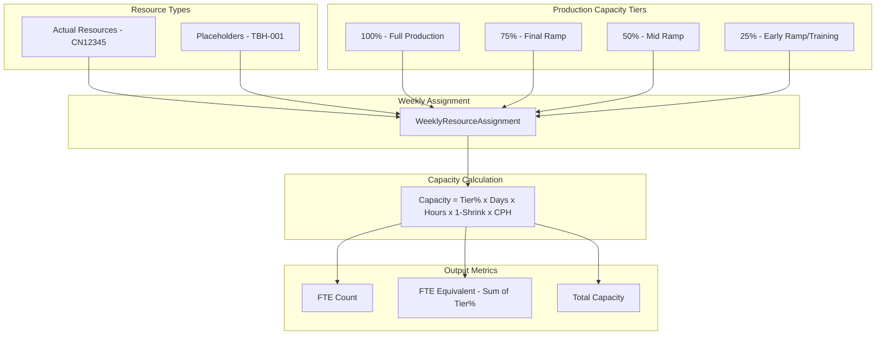

---

## 8. Deployment Architecture

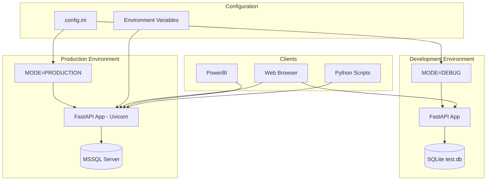

---

## 9. File Structure Diagram

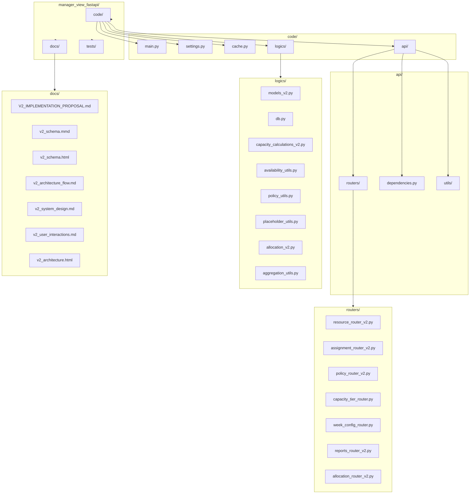

---

## 10. Request Flow Diagram

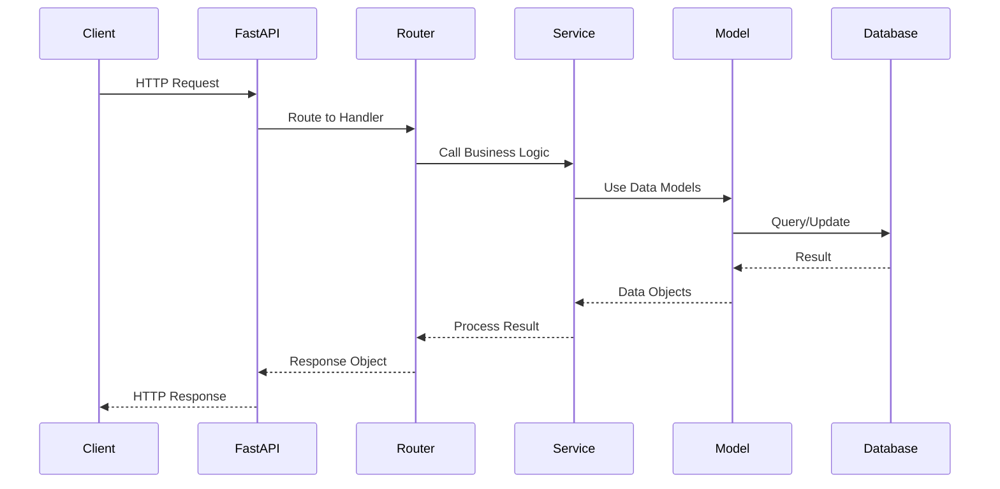

---

## 11. Data Transformation Pipeline

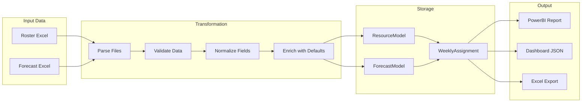

---

*Document Version: 1.1*
*Created: 2026-02-18*
*Updated: 2026-02-18 - Fixed Mermaid syntax issues*
