# V2 Architecture - User Interactions

This document contains sequence diagrams and user interaction flows for the V2 Weekly Capacity & Multi-Group Resource Tracking system.

---

## 1. Resource Creation with Availability Window

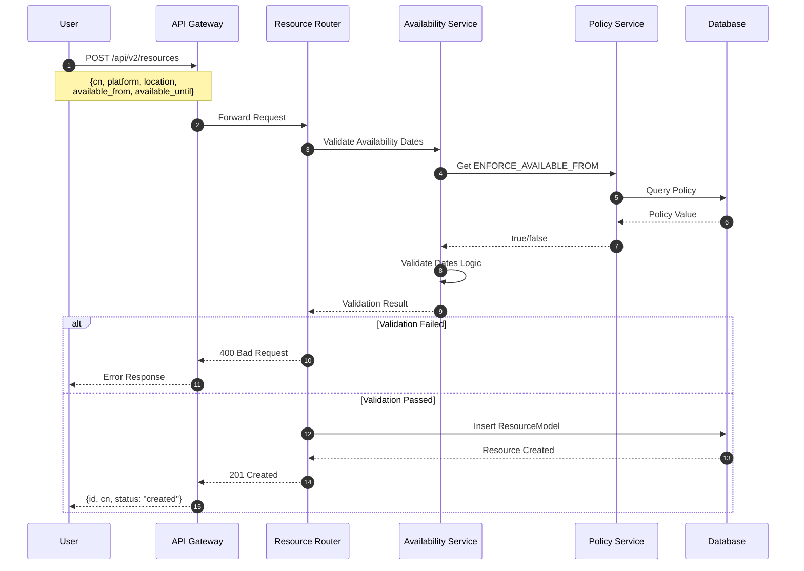
```mermaid
sequenceDiagram
    autonumber
    participant User
    participant API as API Gateway
    participant Router as Resource Router
    participant Service as Availability Service
    participant Policy as Policy Service
    participant DB as Database

    User->>API: POST /api/v2/resources
    Note over User,API: {cn, platform, location,<br/>available_from, available_until}

    API->>Router: Forward Request
    Router->>Service: Validate Availability Dates

    Service->>Policy: Get ENFORCE_AVAILABLE_FROM
    Policy->>DB: Query Policy
    DB-->>Policy: Policy Value
    Policy-->>Service: true/false

    Service->>Service: Validate Dates Logic
    Service-->>Router: Validation Result

    alt Validation Failed
        Router-->>API: 400 Bad Request
        API-->>User: Error Response
    else Validation Passed
        Router->>DB: Insert ResourceModel
        DB-->>Router: Resource Created
        Router-->>API: 201 Created
        API-->>User: {id, cn, status: "created"}
    end
```

---

## 2. Create Placeholder Resources (Batch)

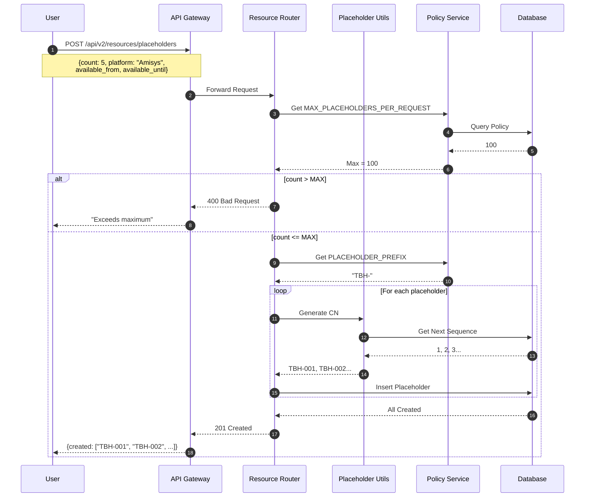
```mermaid
sequenceDiagram
    autonumber
    participant User
    participant API as API Gateway
    participant Router as Resource Router
    participant Placeholder as Placeholder Utils
    participant Policy as Policy Service
    participant DB as Database

    User->>API: POST /api/v2/resources/placeholders
    Note over User,API: {count: 5, platform: "Amisys",<br/>available_from, available_until}

    API->>Router: Forward Request

    Router->>Policy: Get MAX_PLACEHOLDERS_PER_REQUEST
    Policy->>DB: Query Policy
    DB-->>Policy: 100
    Policy-->>Router: Max = 100

    alt count > MAX
        Router-->>API: 400 Bad Request
        API-->>User: "Exceeds maximum"
    else count <= MAX
        Router->>Policy: Get PLACEHOLDER_PREFIX
        Policy-->>Router: "TBH-"

        loop For each placeholder
            Router->>Placeholder: Generate CN
            Placeholder->>DB: Get Next Sequence
            DB-->>Placeholder: 1, 2, 3...
            Placeholder-->>Router: TBH-001, TBH-002...
            Router->>DB: Insert Placeholder
        end

        DB-->>Router: All Created
        Router-->>API: 201 Created
        API-->>User: {created: ["TBH-001", "TBH-002", ...]}
    end
```

---

## 3. Convert Placeholder to Actual Resource

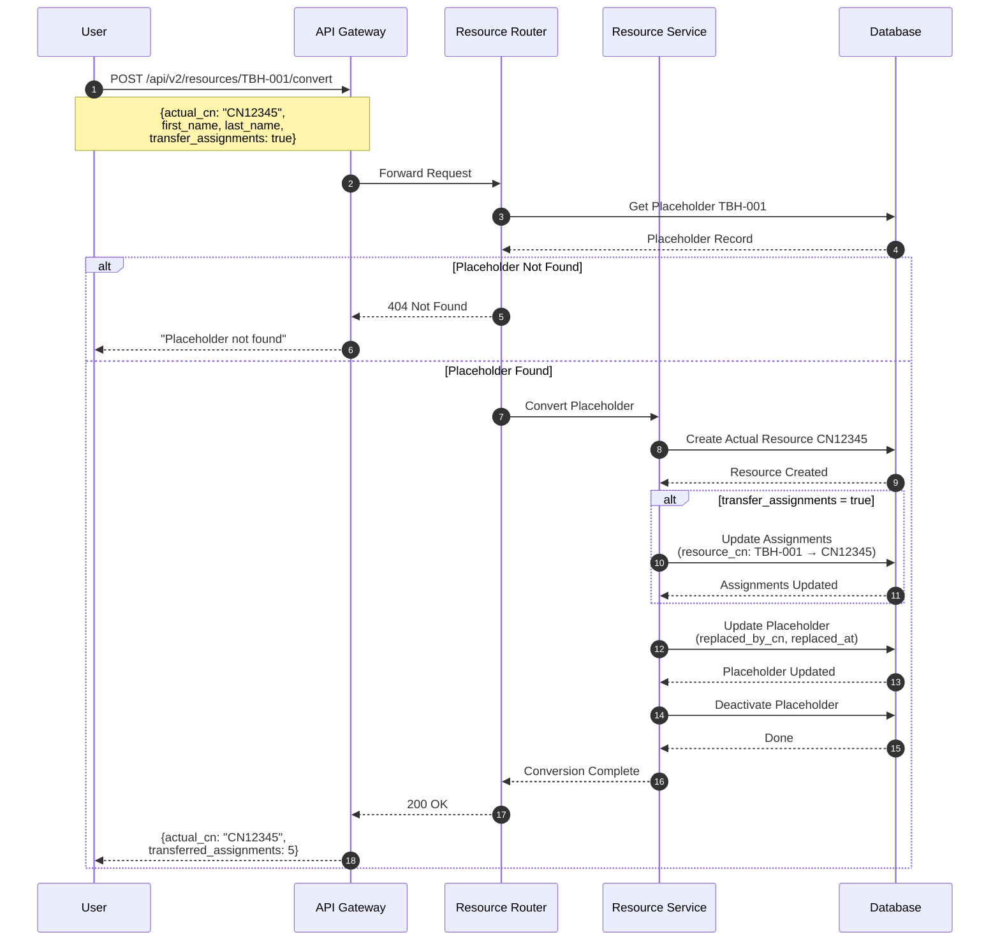
```mermaid
sequenceDiagram
    autonumber
    participant User
    participant API as API Gateway
    participant Router as Resource Router
    participant Service as Resource Service
    participant DB as Database

    User->>API: POST /api/v2/resources/TBH-001/convert
    Note over User,API: {actual_cn: "CN12345",<br/>first_name, last_name,<br/>transfer_assignments: true}

    API->>Router: Forward Request

    Router->>DB: Get Placeholder TBH-001
    DB-->>Router: Placeholder Record

    alt Placeholder Not Found
        Router-->>API: 404 Not Found
        API-->>User: "Placeholder not found"
    else Placeholder Found
        Router->>Service: Convert Placeholder

        Service->>DB: Create Actual Resource CN12345
        DB-->>Service: Resource Created

        alt transfer_assignments = true
            Service->>DB: Update Assignments<br/>(resource_cn: TBH-001 → CN12345)
            DB-->>Service: Assignments Updated
        end

        Service->>DB: Update Placeholder<br/>(replaced_by_cn, replaced_at)
        DB-->>Service: Placeholder Updated

        Service->>DB: Deactivate Placeholder
        DB-->>Service: Done

        Service-->>Router: Conversion Complete
        Router-->>API: 200 OK
        API-->>User: {actual_cn: "CN12345",<br/>transferred_assignments: 5}
    end
```

---

## 4. Weekly Assignment with Availability Check

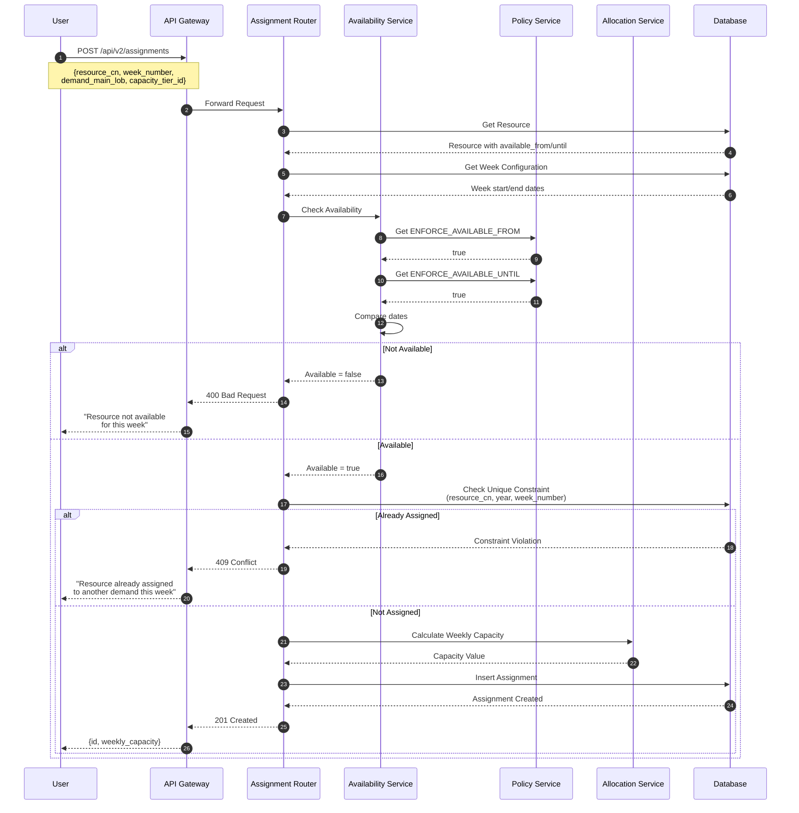
```mermaid
sequenceDiagram
    autonumber
    participant User
    participant API as API Gateway
    participant Router as Assignment Router
    participant Avail as Availability Service
    participant Policy as Policy Service
    participant Alloc as Allocation Service
    participant DB as Database

    User->>API: POST /api/v2/assignments
    Note over User,API: {resource_cn, week_number,<br/>demand_main_lob, capacity_tier_id}

    API->>Router: Forward Request

    Router->>DB: Get Resource
    DB-->>Router: Resource with available_from/until

    Router->>DB: Get Week Configuration
    DB-->>Router: Week start/end dates

    Router->>Avail: Check Availability
    Avail->>Policy: Get ENFORCE_AVAILABLE_FROM
    Policy-->>Avail: true

    Avail->>Policy: Get ENFORCE_AVAILABLE_UNTIL
    Policy-->>Avail: true

    Avail->>Avail: Compare dates

    alt Not Available
        Avail-->>Router: Available = false
        Router-->>API: 400 Bad Request
        API-->>User: "Resource not available<br/>for this week"
    else Available
        Avail-->>Router: Available = true

        Router->>DB: Check Unique Constraint<br/>(resource_cn, year, week_number)

        alt Already Assigned
            DB-->>Router: Constraint Violation
            Router-->>API: 409 Conflict
            API-->>User: "Resource already assigned<br/>to another demand this week"
        else Not Assigned
            Router->>Alloc: Calculate Weekly Capacity
            Alloc-->>Router: Capacity Value

            Router->>DB: Insert Assignment
            DB-->>Router: Assignment Created

            Router-->>API: 201 Created
            API-->>User: {id, weekly_capacity}
        end
    end
```

---

## 5. Execute Allocation (Full Flow)

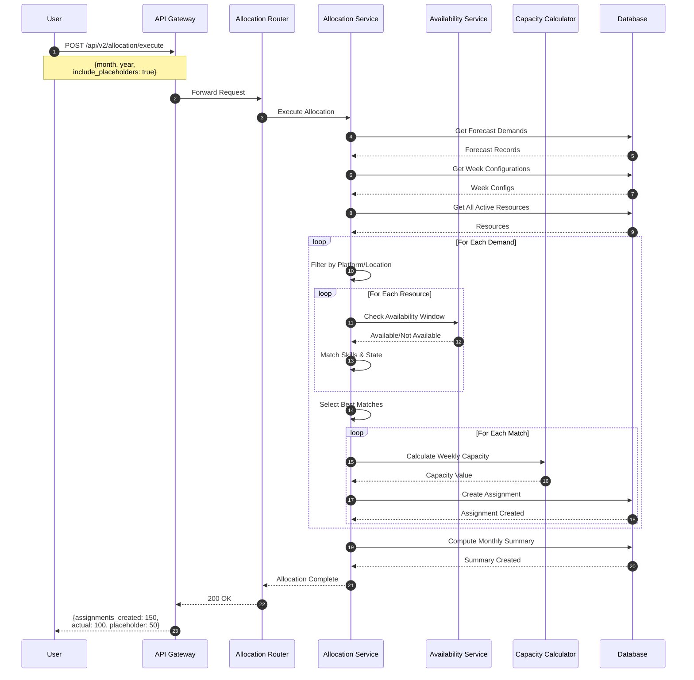
```mermaid
sequenceDiagram
    autonumber
    participant User
    participant API as API Gateway
    participant Router as Allocation Router
    participant Alloc as Allocation Service
    participant Avail as Availability Service
    participant Capacity as Capacity Calculator
    participant DB as Database

    User->>API: POST /api/v2/allocation/execute
    Note over User,API: {month, year,<br/>include_placeholders: true}

    API->>Router: Forward Request

    Router->>Alloc: Execute Allocation

    Alloc->>DB: Get Forecast Demands
    DB-->>Alloc: Forecast Records

    Alloc->>DB: Get Week Configurations
    DB-->>Alloc: Week Configs

    Alloc->>DB: Get All Active Resources
    DB-->>Alloc: Resources

    loop For Each Demand
        Alloc->>Alloc: Filter by Platform/Location

        loop For Each Resource
            Alloc->>Avail: Check Availability Window
            Avail-->>Alloc: Available/Not Available

            Alloc->>Alloc: Match Skills & State
        end

        Alloc->>Alloc: Select Best Matches

        loop For Each Match
            Alloc->>Capacity: Calculate Weekly Capacity
            Capacity-->>Alloc: Capacity Value

            Alloc->>DB: Create Assignment
            DB-->>Alloc: Assignment Created
        end
    end

    Alloc->>DB: Compute Monthly Summary
    DB-->>Alloc: Summary Created

    Alloc-->>Router: Allocation Complete
    Router-->>API: 200 OK
    API-->>User: {assignments_created: 150,<br/>actual: 100, placeholder: 50}
```

---

## 6. Generate PowerBI Report

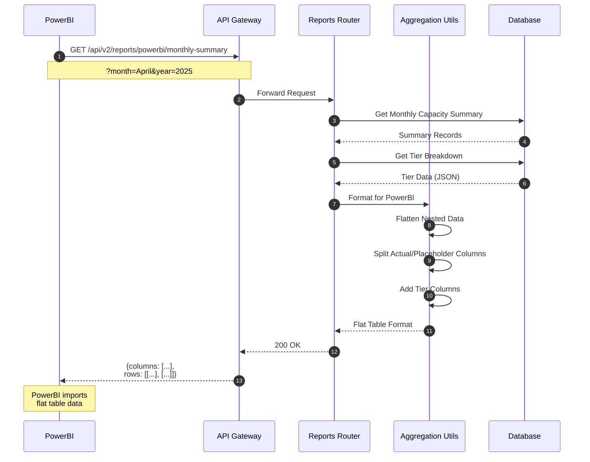
```mermaid
sequenceDiagram
    autonumber
    participant User as PowerBI
    participant API as API Gateway
    participant Router as Reports Router
    participant Agg as Aggregation Utils
    participant DB as Database

    User->>API: GET /api/v2/reports/powerbi/monthly-summary
    Note over User,API: ?month=April&year=2025

    API->>Router: Forward Request

    Router->>DB: Get Monthly Capacity Summary
    DB-->>Router: Summary Records

    Router->>DB: Get Tier Breakdown
    DB-->>Router: Tier Data (JSON)

    Router->>Agg: Format for PowerBI

    Agg->>Agg: Flatten Nested Data
    Agg->>Agg: Split Actual/Placeholder Columns
    Agg->>Agg: Add Tier Columns

    Agg-->>Router: Flat Table Format

    Router-->>API: 200 OK
    API-->>User: {columns: [...],<br/>rows: [[...], [...]]}

    Note over User: PowerBI imports<br/>flat table data
```

---

## 7. Generate Dashboard Report (Nested JSON)

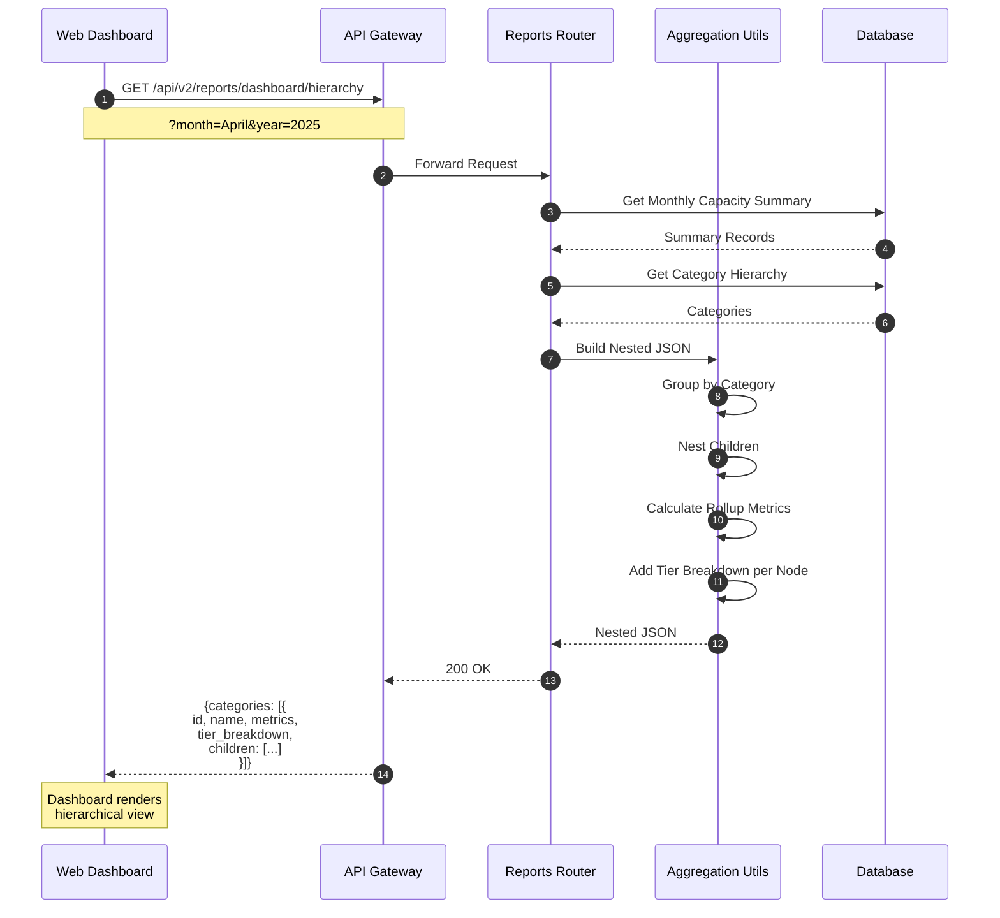
```mermaid
sequenceDiagram
    autonumber
    participant User as Web Dashboard
    participant API as API Gateway
    participant Router as Reports Router
    participant Agg as Aggregation Utils
    participant DB as Database

    User->>API: GET /api/v2/reports/dashboard/hierarchy
    Note over User,API: ?month=April&year=2025

    API->>Router: Forward Request

    Router->>DB: Get Monthly Capacity Summary
    DB-->>Router: Summary Records

    Router->>DB: Get Category Hierarchy
    DB-->>Router: Categories

    Router->>Agg: Build Nested JSON

    Agg->>Agg: Group by Category
    Agg->>Agg: Nest Children
    Agg->>Agg: Calculate Rollup Metrics
    Agg->>Agg: Add Tier Breakdown per Node

    Agg-->>Router: Nested JSON

    Router-->>API: 200 OK
    API-->>User: {categories: [{<br/>  id, name, metrics,<br/>  tier_breakdown,<br/>  children: [...]<br/>}]}

    Note over User: Dashboard renders<br/>hierarchical view
```

---

## 8. Update Policy Setting

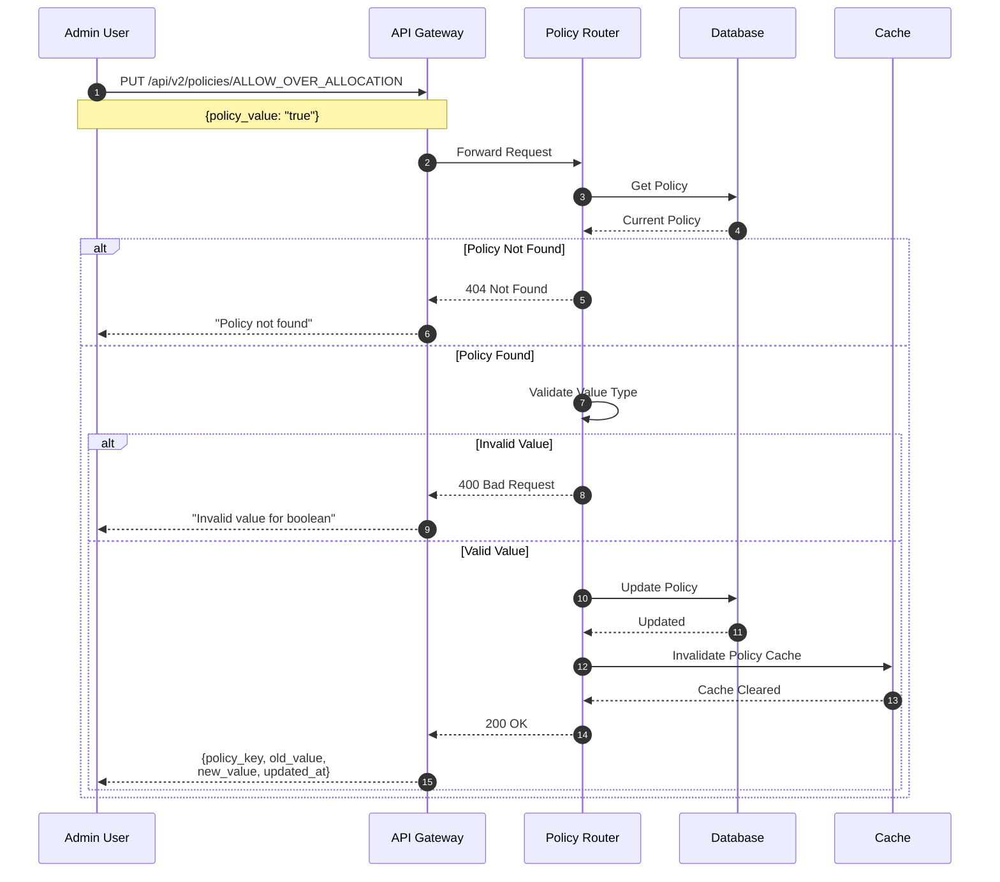
```mermaid
sequenceDiagram
    autonumber
    participant Admin as Admin User
    participant API as API Gateway
    participant Router as Policy Router
    participant DB as Database
    participant Cache as Cache

    Admin->>API: PUT /api/v2/policies/ALLOW_OVER_ALLOCATION
    Note over Admin,API: {policy_value: "true"}

    API->>Router: Forward Request

    Router->>DB: Get Policy
    DB-->>Router: Current Policy

    alt Policy Not Found
        Router-->>API: 404 Not Found
        API-->>Admin: "Policy not found"
    else Policy Found
        Router->>Router: Validate Value Type

        alt Invalid Value
            Router-->>API: 400 Bad Request
            API-->>Admin: "Invalid value for boolean"
        else Valid Value
            Router->>DB: Update Policy
            DB-->>Router: Updated

            Router->>Cache: Invalidate Policy Cache
            Cache-->>Router: Cache Cleared

            Router-->>API: 200 OK
            API-->>Admin: {policy_key, old_value,<br/>new_value, updated_at}
        end
    end
```

---

## 9. Set Week Targets (Auto-Create Placeholders)

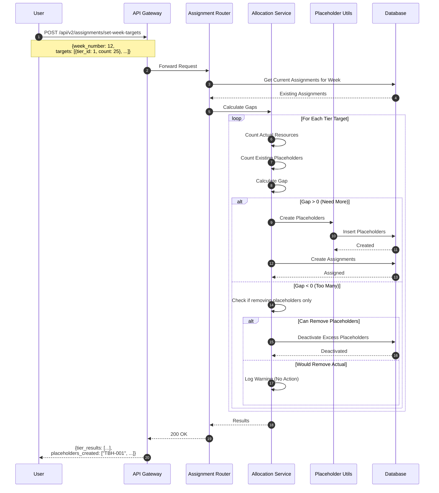
```mermaid
sequenceDiagram
    autonumber
    participant User
    participant API as API Gateway
    participant Router as Assignment Router
    participant Service as Allocation Service
    participant Placeholder as Placeholder Utils
    participant DB as Database

    User->>API: POST /api/v2/assignments/set-week-targets
    Note over User,API: {week_number: 12,<br/>targets: [{tier_id: 1, count: 25}, ...]}

    API->>Router: Forward Request

    Router->>DB: Get Current Assignments for Week
    DB-->>Router: Existing Assignments

    Router->>Service: Calculate Gaps

    loop For Each Tier Target
        Service->>Service: Count Actual Resources
        Service->>Service: Count Existing Placeholders
        Service->>Service: Calculate Gap

        alt Gap > 0 (Need More)
            Service->>Placeholder: Create Placeholders
            Placeholder->>DB: Insert Placeholders
            DB-->>Placeholder: Created

            Service->>DB: Create Assignments
            DB-->>Service: Assigned
        else Gap < 0 (Too Many)
            Service->>Service: Check if removing placeholders only
            alt Can Remove Placeholders
                Service->>DB: Deactivate Excess Placeholders
                DB-->>Service: Deactivated
            else Would Remove Actual
                Service->>Service: Log Warning (No Action)
            end
        end
    end

    Service-->>Router: Results

    Router-->>API: 200 OK
    API-->>User: {tier_results: [...],<br/>placeholders_created: ["TBH-001", ...]}
```

---

## 10. Bulk Import Resources from Roster

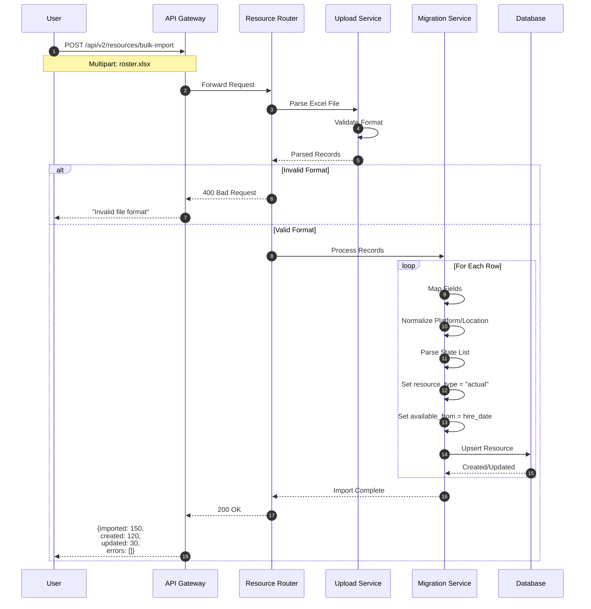
```mermaid
sequenceDiagram
    autonumber
    participant User
    participant API as API Gateway
    participant Router as Resource Router
    participant Upload as Upload Service
    participant Migration as Migration Service
    participant DB as Database

    User->>API: POST /api/v2/resources/bulk-import
    Note over User,API: Multipart: roster.xlsx

    API->>Router: Forward Request

    Router->>Upload: Parse Excel File
    Upload->>Upload: Validate Format
    Upload-->>Router: Parsed Records

    alt Invalid Format
        Router-->>API: 400 Bad Request
        API-->>User: "Invalid file format"
    else Valid Format
        Router->>Migration: Process Records

        loop For Each Row
            Migration->>Migration: Map Fields
            Migration->>Migration: Normalize Platform/Location
            Migration->>Migration: Parse State List
            Migration->>Migration: Set resource_type = "actual"
            Migration->>Migration: Set available_from = hire_date

            Migration->>DB: Upsert Resource
            DB-->>Migration: Created/Updated
        end

        Migration-->>Router: Import Complete

        Router-->>API: 200 OK
        API-->>User: {imported: 150,<br/>created: 120,<br/>updated: 30,<br/>errors: []}
    end
```

---

## 11. Preview Allocation (Dry Run)

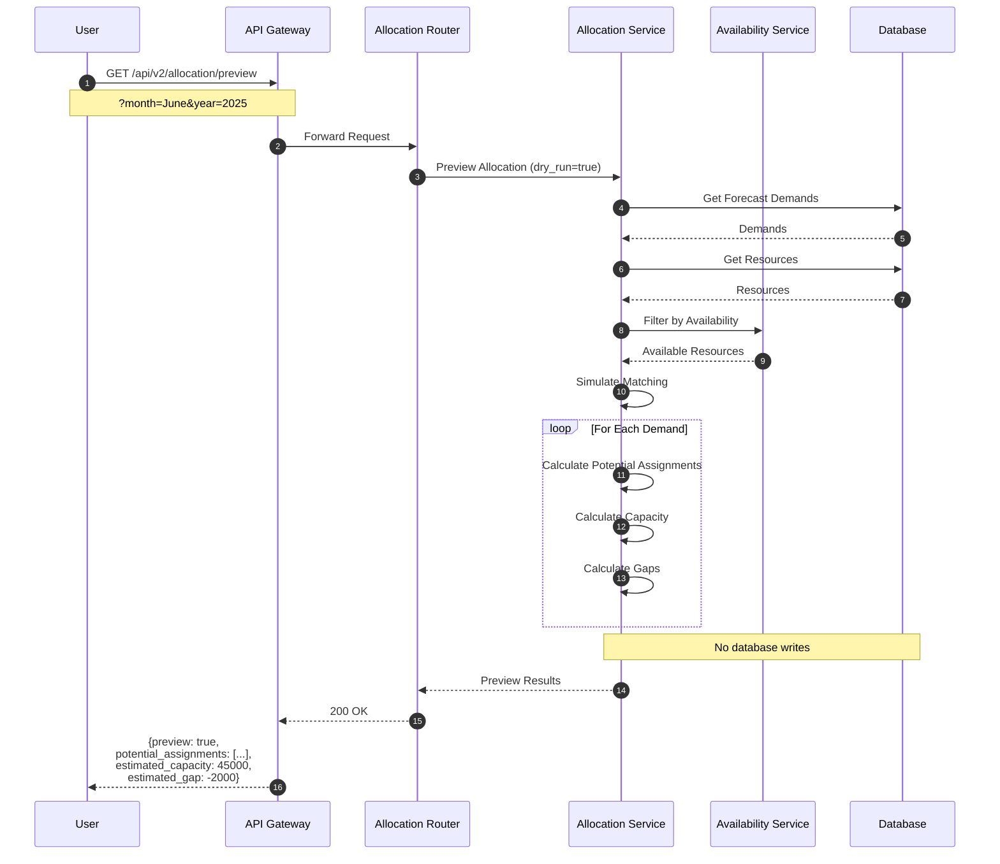
```mermaid
sequenceDiagram
    autonumber
    participant User
    participant API as API Gateway
    participant Router as Allocation Router
    participant Alloc as Allocation Service
    participant Avail as Availability Service
    participant DB as Database

    User->>API: GET /api/v2/allocation/preview
    Note over User,API: ?month=June&year=2025

    API->>Router: Forward Request

    Router->>Alloc: Preview Allocation (dry_run=true)

    Alloc->>DB: Get Forecast Demands
    DB-->>Alloc: Demands

    Alloc->>DB: Get Resources
    DB-->>Alloc: Resources

    Alloc->>Avail: Filter by Availability
    Avail-->>Alloc: Available Resources

    Alloc->>Alloc: Simulate Matching

    loop For Each Demand
        Alloc->>Alloc: Calculate Potential Assignments
        Alloc->>Alloc: Calculate Capacity
        Alloc->>Alloc: Calculate Gaps
    end

    Note over Alloc,DB: No database writes

    Alloc-->>Router: Preview Results

    Router-->>API: 200 OK
    API-->>User: {preview: true,<br/>potential_assignments: [...],<br/>estimated_capacity: 45000,<br/>estimated_gap: -2000}
```

---

## 12. Check Resource Availability for Date Range

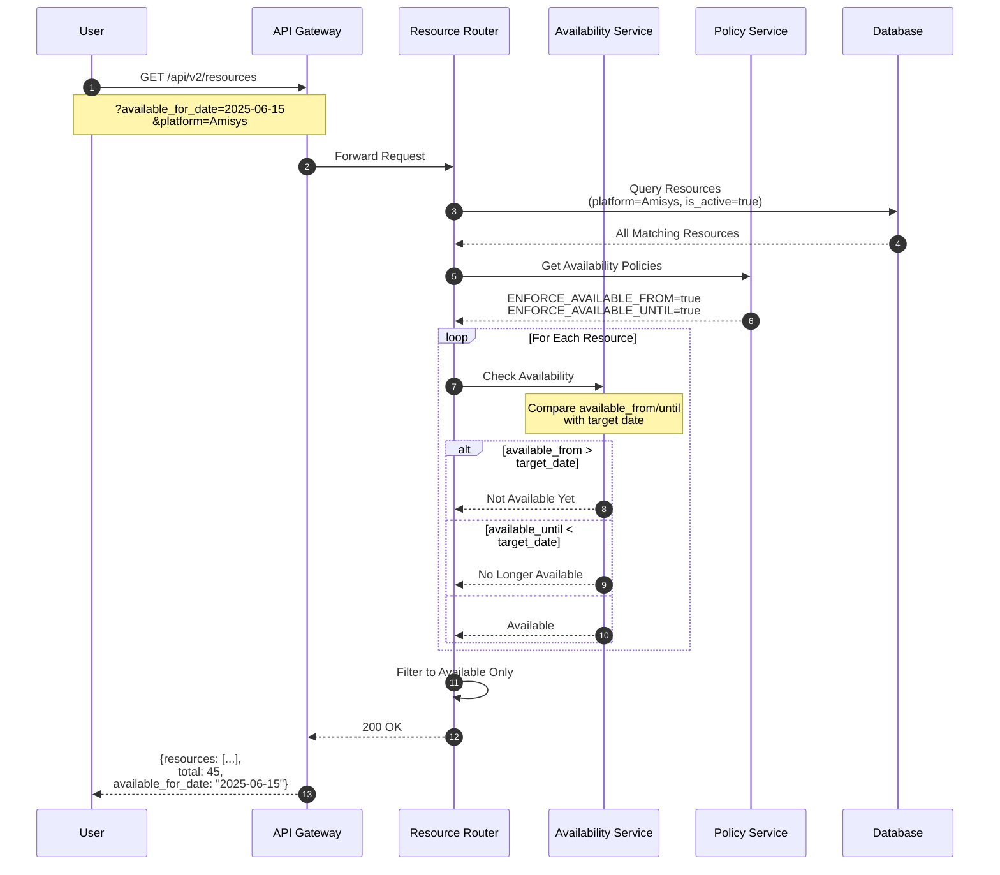
```mermaid
sequenceDiagram
    autonumber
    participant User
    participant API as API Gateway
    participant Router as Resource Router
    participant Avail as Availability Service
    participant Policy as Policy Service
    participant DB as Database

    User->>API: GET /api/v2/resources
    Note over User,API: ?available_for_date=2025-06-15<br/>&platform=Amisys

    API->>Router: Forward Request

    Router->>DB: Query Resources<br/>(platform=Amisys, is_active=true)
    DB-->>Router: All Matching Resources

    Router->>Policy: Get Availability Policies
    Policy-->>Router: ENFORCE_AVAILABLE_FROM=true<br/>ENFORCE_AVAILABLE_UNTIL=true

    loop For Each Resource
        Router->>Avail: Check Availability
        Note over Avail: Compare available_from/until<br/>with target date

        alt available_from > target_date
            Avail-->>Router: Not Available Yet
        else available_until < target_date
            Avail-->>Router: No Longer Available
        else
            Avail-->>Router: Available
        end
    end

    Router->>Router: Filter to Available Only

    Router-->>API: 200 OK
    API-->>User: {resources: [...],<br/>total: 45,<br/>available_for_date: "2025-06-15"}
```

---

## Key User Workflows Summary

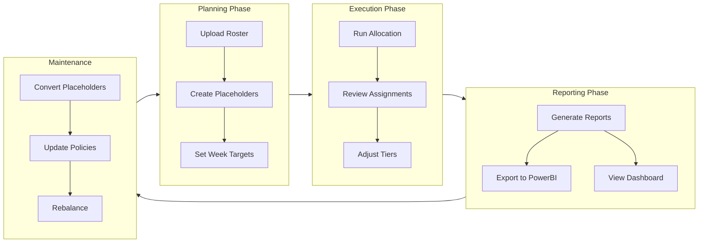
```mermaid
graph LR
    subgraph Planning["Planning Phase"]
        P1["Upload Roster"] --> P2["Create Placeholders"]
        P2 --> P3["Set Week Targets"]
    end

    subgraph Execution["Execution Phase"]
        E1["Run Allocation"] --> E2["Review Assignments"]
        E2 --> E3["Adjust Tiers"]
    end

    subgraph Reporting["Reporting Phase"]
        R1["Generate Reports"] --> R2["Export to PowerBI"]
        R1 --> R3["View Dashboard"]
    end

    subgraph Maintenance["Maintenance"]
        M1["Convert Placeholders"] --> M2["Update Policies"]
        M2 --> M3["Rebalance"]
    end

    Planning --> Execution
    Execution --> Reporting
    Reporting --> Maintenance
    Maintenance --> Planning
```

---

*Document Version: 1.0*
*Created: 2026-02-18*
